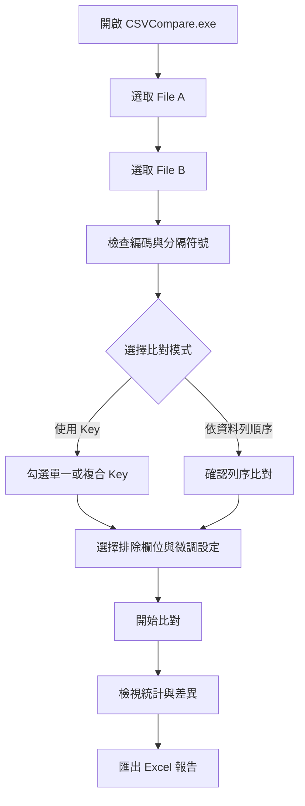

# CSV Compare 使用者操作手冊

CSV Compare 是 Windows 桌面版 CSV／TXT 資料核對工具。它會在本機讀取兩個分隔文字檔，依欄位名稱、Key 或資料列順序進行比對，並可將差異匯出為 Excel 報告。

所有檔案解析與比對都在本機完成，不需要上傳檔案或連線到後端服務。原始 CSV／TXT 不會被修改。

## 目錄

- [快速開始](#快速開始)
- [整體使用流程](#整體使用流程)
- [介面區域](#介面區域)
- [選取與設定檔案](#選取與設定檔案)
- [設定比對方式](#設定比對方式)
- [執行與閱讀結果](#執行與閱讀結果)
- [匯出 Excel 報告](#匯出-excel-報告)
- [支援格式與比對規則](#支援格式與比對規則)
- [離線、隱私與資料安全](#離線隱私與資料安全)
- [常見問題與故障排除](#常見問題與故障排除)
- [維護者建置與驗證](#維護者建置與驗證)

## 快速開始

### 一般使用者：直接開啟 Portable 版本

1. 取得由維護者提供的 Portable 發佈資料夾。
2. 在 Windows 10／11 64 位元電腦上雙擊 `CSVCompare.exe`。
3. 依序選取 File A 與 File B，設定比對方式後按「開始比對」。
4. 若需要留存結果，按「匯出 Excel (.xlsx)」並選擇輸出位置。

本專案的 `portable/CSVCompare.exe` 是建置時產生的執行檔，不應視為原始碼的一部分，也不會透過 Git 入庫。正式交付時請由維護者另外提供執行檔或安裝包。

### 啟動前檢查

- Windows 10／11 64 位元。
- Windows 已具備 Microsoft Edge WebView2 Runtime；大多數 Windows 10／11 電腦已預先安裝。
- 確認目前帳號可以讀取要比對的 CSV／TXT 檔案，以及寫入 Excel 輸出的資料夾。

## 整體使用流程



## 介面區域

- **標題列**：顯示 CSV Compare、版本標籤與本機離線核對提示。
- **File A／File B 來源檔案設定**：輸入路徑、瀏覽檔案、指定編碼與分隔符號，並查看解析後的欄位數與資料列數。
- **比對模式與欄位配置**：選擇 Key-based 或 Row-by-Row，設定 Key、排除欄位及字串比較選項。
- **進度區**：比對進行中顯示處理狀態，可按「取消」中止。
- **結果區**：顯示總列數、相同／相異筆數、A／B 獨有資料、相異儲存格與重複 Key。
- **差異明細區**：搜尋、篩選、分頁檢視差異，並重新設定或匯出 Excel。

## 選取與設定檔案

### 1. 選取來源檔案

在 File A 或 File B 的「檔案路徑」欄位中：

- 按「瀏覽」開啟檔案選擇器；預設可選 `.csv`、`.txt`，也可切換所有檔案。
- 或直接貼上完整檔案路徑。
- 清除路徑後，該檔案的解析資訊會一併清除。

檔案路徑變更後，程式會自動重新解析。解析完成會顯示「已成功解析」、欄位數與資料列數；按「重新偵測」可手動再次解析。

### 2. 設定文字編碼

可選擇「Auto 自動偵測」或手動指定：

- UTF-8
- UTF-8 BOM
- CP950（繁體中文 Windows／Excel）
- Big5
- UTF-16 LE
- UTF-16 BE

若檔案含繁體中文且自動偵測結果不正確，請改選 `CP950` 或 `Big5`。若檔案來自 UTF-16 系統，請手動選擇對應的 UTF-16 編碼。

### 3. 設定分隔符號

可選擇「Auto 自動偵測」或手動指定：

- 逗號 `,`
- 管線符號 `|`
- Tab `\t`
- 分號 `;`
- 冒號 `:`
- 自訂單一字元，例如 `^`

File A 與 File B 可以使用不同的分隔符號。若畫面顯示的欄位數明顯不正確，請手動指定分隔符號後按「重新偵測」。

## 設定比對方式

### 使用 Key 比對（推薦）

適合兩個檔案的資料列順序不同，但每筆資料都有可識別欄位的情況。

1. 選擇「使用 Key 比對」。
2. 在共同欄位清單中勾選一個或多個 Key 欄位。
3. 確認畫面上的 Composite Key 結構，例如 `客戶編號 + 交易日期 + 交易序號`。
4. Key 欄位必須能唯一識別資料；重複 Key 會在結果中列出，不能當作一般相同資料配對。

程式會依欄位名稱自動對齊 File A 與 File B，即使兩檔的欄位順序不同，也能依 Key 找到對應資料。

### 依資料列順序比對（Row-by-Row）

適合兩個檔案已經按照相同順序排列的情況。

- 第 1 列對第 1 列、第 2 列對第 2 列，以此類推。
- 欄位仍依 Header 名稱對齊，不要求兩個檔案的欄位順序相同。
- 不需要選擇 Key。

### 排除比較欄位

在「排除比較欄位」區塊勾選不影響一致性判定的共同欄位，例如更新時間、匯出時間或經辦資訊。

- 排除欄位仍會保留在檔案與報告中，只是不會用來判定內容差異。
- 已選為 Key 的欄位不能排除。
- 可使用「全選」、「清除」或「反向選取」快速調整。

### 比對微調設定

- **數值誤差容許值**：預設為 `0`，統一套用所有參與比對的數值儲存格。當 `|A − B| ≤ 容許值` 時視為相同，包含等於門檻。例如設為 `0.1`，`1` 與 `1.1` 相同，與 `1.11` 不同。
- **忽略前後空白**：比較時忽略欄位值前後的空白。
- **忽略英文字母大小寫**：比較時將英文字母大小寫視為相同。

這些選項只影響比對判定，不會修改原始資料或 Excel 報告中的原始值。

數值比對預設啟用，設定 `0` 時，`001`、`1.0`、`1` 也視為相同。支援正負整數、小數、科學記號（例如 `1e-3`）及標準千分位（例如 `1,234.50`），採十進位精確運算。使用逗號作為 CSV 分隔符號時，含千分位的欄位須以雙引號包覆。

雙方儲存格皆為有效數值才套用容許值；百分比、貨幣符號、括號負數、空值、`NaN`、無限值及不正確的千分位（例如 `12,34`）依文字比對。前後空白僅在勾選「忽略前後空白」時移除。每個數值最多 4096 字元，科學記號指數介於 -4096 至 4096；資料超出範圍時依文字比對，容許值超出範圍則顯示錯誤並禁止開始比對。

Key 模式的鍵值配對及重複 Key 偵測仍依原始文字判定，例如 Key `001` 與 `1` 不會配對；逐列模式則對所有未排除的共同欄位套用數值規則。容許範圍內的差異不列入差異明細及相異統計。畫面與 Excel Summary 顯示本次執行的容許值，結果相同代表「依目前比對規則相同」。

同一次開啟程式期間會保留輸入的容許值，重新啟動回到 `0`。空白、負數或無效容許值會顯示錯誤並禁止開始比對；回到設定調整後須重新比對才會更新結果。

可使用 `sample_data/numeric_tolerance_a.csv` 與 `sample_data/numeric_tolerance_b.csv` 試用，Key 選 `ID`，容許值設為 `0.1`：應有 3 筆相同、1 筆相異，差異為 ID `003` 的 Amount `1` 與 `1.11`。兩種比對模式均適用。

## 執行與閱讀結果

1. 確認 File A、File B 都顯示「已成功解析」。
2. Key-based 模式至少勾選一個 Key；Row-by-Row 模式不需要 Key。
3. 按「開始比對」。
4. 大型檔案處理時可查看進度，必要時按「取消」。

結果摘要會顯示：

- File A／File B 總列數
- 相同筆數與相異筆數
- 相異儲存格數
- 僅存在於 A 或 B 的資料筆數
- 重複 Key 數

結果區提供三種檢視：

- **差異明細清單**：顯示 Key、差異欄位、File A 值、File B 值、列號與差異類型。
- **欄位結構比對**：查看欄位在兩個檔案是否存在，以及 `SAME`、`A_ONLY`、`B_ONLY` 狀態。
- **重複 Key 清單**：只有偵測到重複 Key 時顯示，包含來源檔案、Key 值、重複次數與列號。

差異明細可使用：

- 關鍵字搜尋 Key、欄位名稱、資料值、列號或差異類型。
- 類型篩選：全部、內容變更、A 獨有、B 獨有、重複 Key、空／不完整 Key。
- 每頁 50、100 或 200 筆，以及上一頁／下一頁切換。

## 匯出 Excel 報告

在結果區按「匯出 Excel (.xlsx)」，選擇輸出路徑後即可產生報告。報告包含五個工作表：

1. **Summary**：本次執行的檔案資訊、比對設定（含 Numeric Tolerance 數值容許值）與統計摘要。
2. **Differences**：每一筆差異的 Key、列號、欄位與 A／B 原始值。
3. **Column_Differences**：兩檔欄位存在狀態與欄位差異。
4. **Excluded_Columns**：被排除比較的欄位。
5. **Duplicate_Keys**：重複 Key 的來源、Key 值、次數與資料列號。

匯出前請確認：

- 輸出資料夾具有寫入權限。
- 同名 `.xlsx` 沒有被 Excel 或其他程式鎖定。
- 磁碟有足夠空間。


## 支援格式與比對規則

- 支援 `.csv`、`.txt` 等以分隔符號組成的文字檔。
- 支援逗號、分號、Tab、管線符號、冒號與自訂分隔符號。
- 支援雙引號包覆欄位、欄位內含分隔符號、跳脫雙引號與欄位內換行。
- 第一列視為 Header；兩檔會依 Header 名稱找出共同欄位。
- 原始值及匯出內容保留 `001`、`000123` 等前導零；數值比對時按數值與容許值判定。
- Key-based 比對會忽略資料列順序；Row-by-Row 會依資料列順序配對。
- 重複 Header、缺少共同欄位、缺少指定 Key 或空／不完整 Key 會被列為錯誤或差異。

## 離線、隱私與資料安全

- 檔案解析、比對與 Excel 產生都在本機執行。
- 程式不需要後端服務、雲端帳號或資料庫。
- 原始 CSV／TXT 只以使用者指定的路徑讀取，不會被程式覆寫。
- 比對結果不會自動保存到應用程式資料庫；需要留存時請主動匯出 Excel。
- 請依組織規範保護來源檔與匯出的報告，尤其是包含個資、帳務或金融資料時。

## 常見問題與故障排除

### 開啟檔案時顯示中文亂碼

在該檔案的「文字編碼」下拉選單改選 `CP950` 或 `Big5`，再按「重新偵測」。若檔案是 UTF-16，改選 `UTF-16 LE` 或 `UTF-16 BE`。

### 欄位數只有 1 欄或明顯不正確

通常是分隔符號偵測不正確。確認來源檔實際使用的符號，再在「分隔符號」下拉選單手動選擇，最後按「重新偵測」。File A 與 File B 可分別設定不同符號。

### 顯示「比對未找到任何共同欄位」

請檢查兩檔第一列 Header 是否真的相同。也要確認編碼與分隔符號正確，否則整列 Header 可能被解析成單一欄位或出現亂碼。

### 顯示「比對未指定任何 Key 欄位」

目前使用 Key-based 模式但尚未勾選 Key。請在共同欄位清單至少勾選一欄；若只想按列順序比對，請改選 Row-by-Row。

### 顯示「發現重複欄位名稱」

來源檔 Header 含有重複欄位名稱。請在 Excel 或文字編輯器中修正第一列欄位名稱後重新載入。

### 匯出 Excel 失敗

確認輸出檔案未被 Excel 開啟、目標資料夾可寫入、檔名副檔名為 `.xlsx`，並檢查磁碟空間。

### 需要中止大型比對

在進度區按「取消」。程式會停止目前比對；若要重新執行，請再次按「開始比對」。

## 維護者建置與驗證

以下內容供維護者使用，不是一般使用者的必要步驟。

### 建置環境

- Node.js 18 以上與 npm
- Rust／Cargo
- Windows 10／11 及 WebView2 Runtime

### 安裝前端相依套件

```powershell
npm install
```

### 建置前端

```powershell
npm run build
```

### 建置桌面版

完整 Release 建置（包含 Tauri 執行檔與 NSIS／MSI 安裝包）：

```powershell
npm run build:desktop
```

也可以使用 Windows 建置腳本：

```powershell
.\build.bat              # Release 與安裝包
.\build.bat portable     # 只建置可攜式執行檔
.\build.bat debug        # Debug 建置
```

建置腳本會把執行檔複製到 `portable/CSVCompare.exe`。`portable/`、`dist/`、`src-tauri/target/`、`.exe`、`.dll` 與其他編譯／打包產物已列入 `.gitignore`，不應提交到版本庫。

### 開發模式

```powershell
npm run tauri -- dev
```

### Rust 測試

```powershell
Set-Location src-tauri
cargo test --all-targets
cargo fmt --all -- --check
```

## 專案目錄簡介

- `src/`：React 使用者介面。
- `src-tauri/src/parser/`：編碼、分隔符號與分隔文字解析。
- `src-tauri/src/compare/`：Key-based 與 Row-by-Row 比對。
- `src-tauri/src/excel/`：Excel 報告產生。
- `test-data/`：整合測試用資料。
- `sample_data/`：可供人工驗收的範例資料。
- `SPEC.md`：完整功能規格與驗收條件。
- `build.bat`：Windows 桌面版建置腳本。
